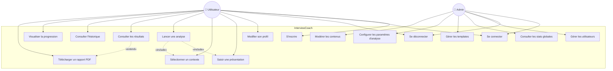
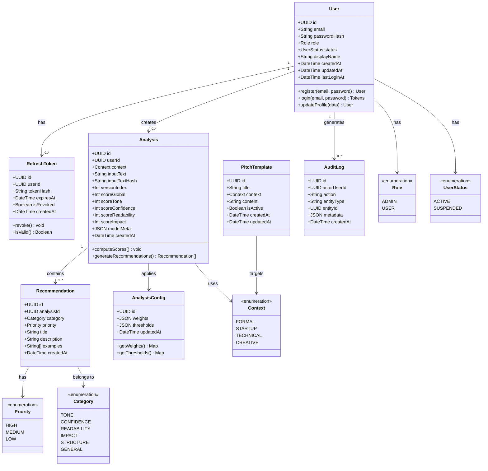
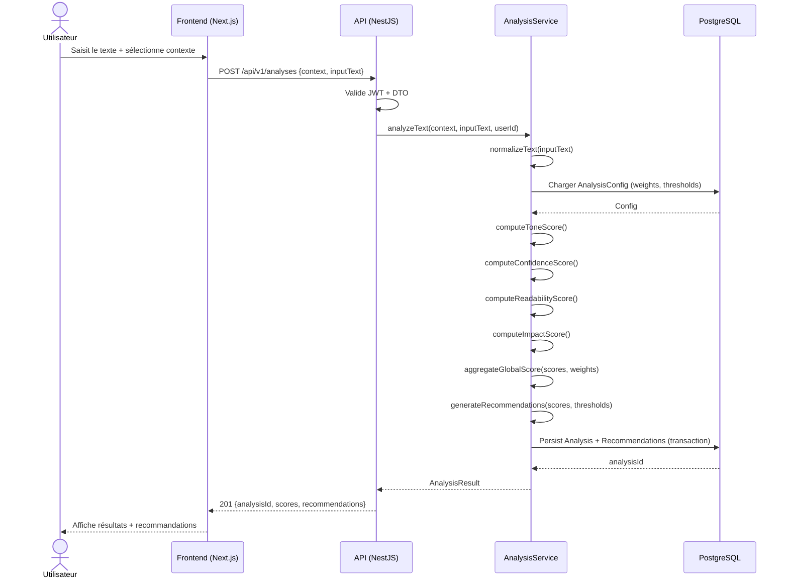
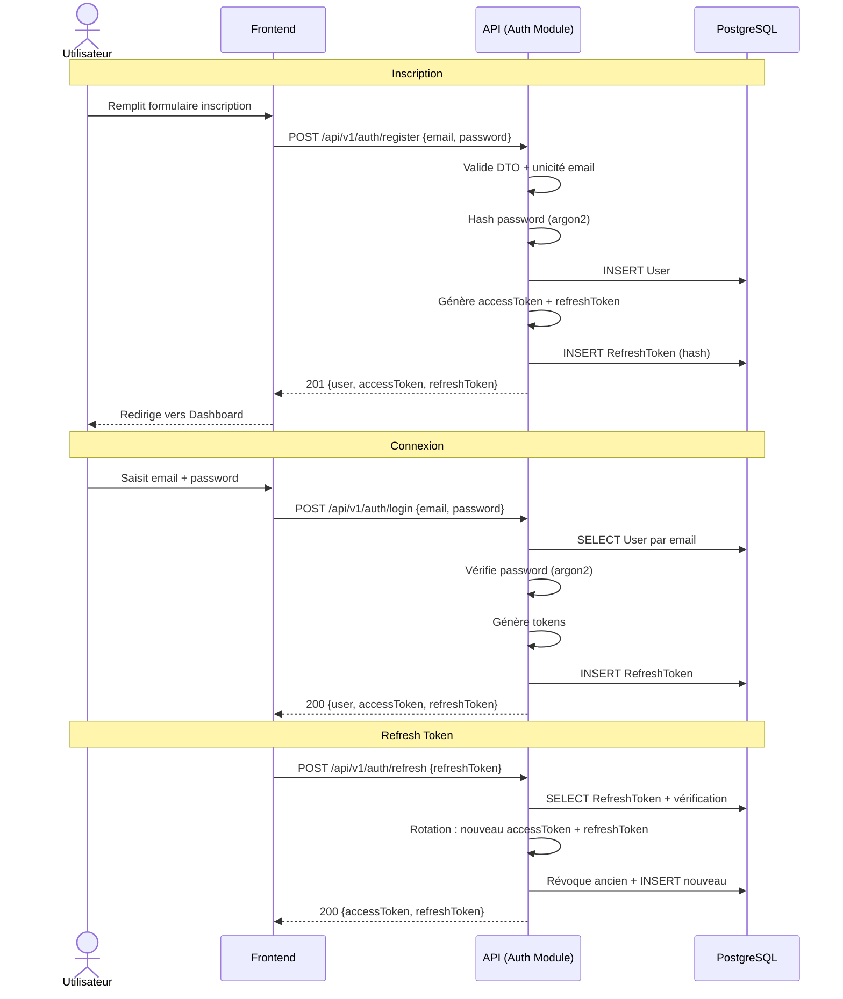
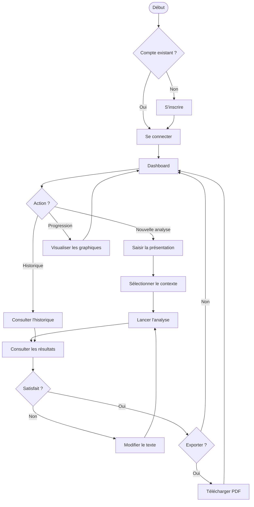

# Conception UML — InterviewCoach

---

## 1) Diagramme de cas d'utilisation (Use Case)

---

## 2) Description des cas d'utilisation

### Acteur : Utilisateur (Candidat)

| # | Cas d'utilisation | Description | Préconditions | Postconditions |
|---|-------------------|-------------|---------------|----------------|
| UC1 | S'inscrire | Créer un compte avec email et mot de passe | Aucune | Compte créé, tokens générés |
| UC2 | Se connecter | Authentification par email/password | Compte existant et actif | Tokens JWT générés |
| UC3 | Se déconnecter | Invalidation du refresh token | Être authentifié | Session invalidée |
| UC4 | Modifier son profil | Mettre à jour les infos personnelles | Être authentifié | Profil mis à jour |
| UC5 | Saisir une présentation | Écrire ou coller un texte de pitch | Être authentifié | Texte prêt pour analyse |
| UC6 | Sélectionner un contexte | Choisir : Formel, Startup, Technique, Créatif | Être authentifié | Contexte sélectionné |
| UC7 | Lancer une analyse | Soumettre le texte + contexte pour analyse IA | UC5 + UC6 complétés | Analyse créée avec scores et recommandations |
| UC8 | Consulter les résultats | Voir score global, scores par catégorie, recommandations | Analyse existante | Résultats affichés |
| UC9 | Consulter l'historique | Lister toutes les analyses passées | Être authentifié | Liste des analyses affichée |
| UC10 | Visualiser la progression | Voir l'évolution des scores dans le temps (graphique) | Au moins 2 analyses | Graphique de progression affiché |
| UC11 | Télécharger un rapport PDF | Exporter les résultats d'une analyse en PDF | Analyse existante | Fichier PDF téléchargé |

### Acteur : Admin

| # | Cas d'utilisation | Description | Préconditions | Postconditions |
|---|-------------------|-------------|---------------|----------------|
| UC12 | Gérer les utilisateurs | Lister, suspendre, réactiver des comptes | Rôle ADMIN | Statut utilisateur modifié |
| UC13 | Consulter les stats globales | Voir nb analyses, score moyen, taux d'amélioration | Rôle ADMIN | Statistiques affichées |
| UC14 | Gérer les templates | CRUD de templates de présentation par contexte | Rôle ADMIN | Templates mis à jour |
| UC15 | Configurer les paramètres d'analyse | Modifier poids et seuils de scoring | Rôle ADMIN | Configuration mise à jour |
| UC16 | Modérer les contenus | Examiner et agir sur les contenus signalés | Rôle ADMIN | Contenu modéré |

---

## 3) Diagramme de classes (Class Diagram)

---

## 4) Diagramme de séquence — Flux d'analyse

---

## 5) Diagramme de séquence — Authentification

---

## 6) Diagramme d'activité — Workflow utilisateur complet

