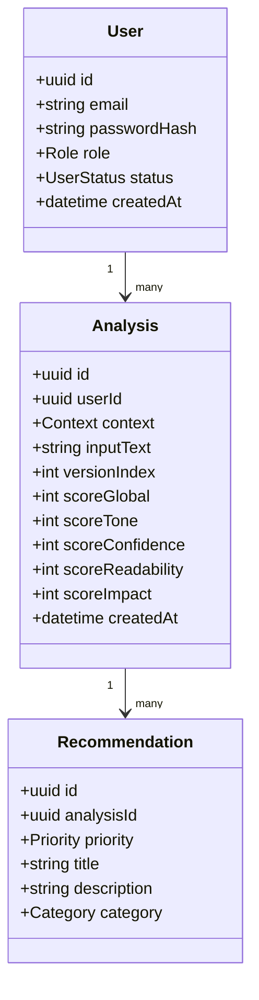

# Spécification Technique — InterviewCoach

> 🔒 Ce document est une **spécification** pour construire InterviewCoach en **MVP sécurisé** (5–7 jours), avec **best practices** et une base solide pour évoluer.
>
> - Stack cible : **Next.js (TS)** + **NestJS (TS)** + **PostgreSQL** (recommandé pour analytics) + Docker + GitHub Actions.
> - Auth : **JWT access + refresh** (rotation) + RBAC (Admin/User).
> - Règles métier imposées : historique immuable, score 0–100, recommandations priorisées.

---

## 1) Périmètre MVP

- Saisie d'une présentation (texte) + sélection d'un contexte (Formel, Startup, Technique, Créatif)
- Lancement d'analyse (IA/règles)
- Résultats : score global + scores par catégorie + recommandations HIGH/MEDIUM/LOW
- Historique des analyses (versions)
- Progression dans le temps (dashboard)
- Export PDF (rapport)
- Admin : stats globales + gestion utilisateurs + templates + paramètres d'analyse

---

## 2) Domain model (concepts)

### Entités

- **User**
  - `id`, `email` (unique), `passwordHash`, `role` (ADMIN|USER), `createdAt`, `updatedAt`, `lastLoginAt`, `status` (ACTIVE|SUSPENDED)

- **PitchTemplate** (admin)
  - `id`, `title`, `context` (FORMAL|STARTUP|TECHNICAL|CREATIVE), `content`, `isActive`, `createdAt`

- **Analysis**
  - `id`, `userId`, `context`, `inputText`, `inputTextHash`, `versionIndex`, `createdAt`
  - `scoreGlobal` (0..100)
  - `scoreTone` (0..100), `scoreConfidence` (0..100), `scoreReadability` (0..100), `scoreImpact` (0..100)
  - `modelMeta` (provider, model, promptVersion) *(optionnel MVP)*

- **Recommendation**
  - `id`, `analysisId`
  - `category` (TONE|CONFIDENCE|READABILITY|IMPACT|STRUCTURE|GENERAL)
  - `priority` (HIGH|MEDIUM|LOW)
  - `title`, `description`, `examples` (optionnel), `createdAt`

- **AnalysisConfig** (admin)
  - `id` (singleton), `weights` (json), `thresholds` (json), `updatedAt`

- **AuditLog** *(optionnel MVP, fortement recommandé)*
  - `id`, `actorUserId`, `action`, `entityType`, `entityId`, `metadata`, `createdAt`

### Règles métier

- Une analysis appartient à **un user authentifié**.
- scoreGlobal **entre 0 et 100**.
- Recommandations triées par **priority** (HIGH, MEDIUM, LOW).
- Historique : **pas de suppression automatique**.
- Nouvelle version du texte → **nouvelle Analysis** (`versionIndex++`), score recalculé.
- Les analyses sont conservées pour comparaison temporelle.

---

## 3) API Back-end (NestJS) — modules, routes, DTO, sécurité

### Conventions

- Base URL : `/api/v1`
- Réponses d'erreur : format unique (`code`, `message`, `details`, `requestId`)
- Validation : `class-validator` + `ValidationPipe({ whitelist: true, forbidNonWhitelisted: true, transform: true })`
- Auth : `Authorization: Bearer <accessToken>`
- Roles : `@Roles('ADMIN')` + `RolesGuard`
- Rate limiting : `@nestjs/throttler` (au moins pour login + analyse)
- Security headers : `helmet`
- CORS : restreint aux origines Front

---

### Module : Auth

**Objectif :** inscription/connexion sécurisées, refresh tokens, RBAC.

#### Endpoints

| Méthode | Route             | Body DTO                        | Description                                      |
| ------- | ----------------- | ------------------------------- | ------------------------------------------------ |
| `POST`  | `/auth/register`  | `email`, `password`             | Inscription. Email unique, password policy. Returns user + tokens. |
| `POST`  | `/auth/login`     | `email`, `password`             | Connexion. Returns user + tokens.                |
| `POST`  | `/auth/refresh`   | `refreshToken` (ou cookie httpOnly) | Returns new accessToken (+ new refreshToken si rotation). |
| `POST`  | `/auth/logout`    | —                               | Invalidates refresh token (server-side).         |

#### Implementation notes

- Hash : `argon2` (recommended) or bcrypt
- Refresh tokens : stockés hashés (DB) + rotation + révocation
- Cookies (option) : refresh en `httpOnly`, `secure`, `sameSite=strict`

---

### Module : Users

#### Endpoints

| Méthode | Route                       | Accès       | Description                                          |
| ------- | --------------------------- | ----------- | ---------------------------------------------------- |
| `GET`   | `/users/me`                 | USER/ADMIN  | Profil courant                                       |
| `PATCH` | `/users/me`                 | USER/ADMIN  | Modifier champs safe (ex: displayName). Pas email/password ici. |
| `GET`   | `/admin/users`              | ADMIN       | Pagination, filtre status/role                       |
| `PATCH` | `/admin/users/:id/status`   | ADMIN       | ACTIVE/SUSPENDED                                     |

---

### Module : Analyses

**Objectif :** créer une analyse, lire une analyse, lister l'historique.

#### Endpoints

| Méthode | Route            | Body / Query                              | Description                                              |
| ------- | ---------------- | ----------------------------------------- | -------------------------------------------------------- |
| `POST`  | `/analyses`      | Body : `context`, `inputText`             | Crée Analysis + Recommendations (transaction). Returns analysisId + scores + recommendations. |
| `GET`   | `/analyses/:id`  | —                                         | Access : owner or ADMIN.                                 |
| `GET`   | `/analyses`      | Query : `page`, `pageSize`, `context?`, `from?`, `to?` | User voit les siennes, admin peut filtrer `userId`.      |

#### Rules

- `versionIndex` calculé : dernier index du user + 1 (par contexte ou global ; choisir global MVP)
- Persist `inputText` (pour historique), mais prévoir limites taille et sanitation

---

### Module : Recommendations

| Méthode | Route                                    | Description                                    |
| ------- | ---------------------------------------- | ---------------------------------------------- |
| `GET`   | `/analyses/:id/recommendations`          | Tri : HIGH → MEDIUM → LOW                     |
| `POST`  | `/admin/recommendations/templates`       | *(Optionnel)* Catalogue de recommandations      |

---

### Module : Statistics

#### User

| Méthode | Route                    | Description                                        |
| ------- | ------------------------ | -------------------------------------------------- |
| `GET`   | `/stats/me/progression`  | Séries temporelles (date, scoreGlobal, categories) |

#### Admin

| Méthode | Route                      | Description                          |
| ------- | -------------------------- | ------------------------------------ |
| `GET`   | `/admin/stats/overview`    | Nb analyses, score moyen, taux d'amélioration |
| `GET`   | `/admin/stats/by-context`  | Comparaisons par contexte            |

#### Implementation

Calcul du "taux d'amélioration" (MVP) :

- Par user : `(dernier score - premier score) / max(1, nbAnalyses - 1)`
- Global : moyenne des deltas utilisateurs

---

### Module : PDF Export

| Méthode | Route                    | Accès         | Description                          |
| ------- | ------------------------ | ------------- | ------------------------------------ |
| `POST`  | `/analyses/:id/pdf`      | Owner / ADMIN | Returns PDF (stream) ou URL signée   |

#### Implementation options

- Generate server-side via :
  - `pdfmake` / `puppeteer` (HTML → PDF) / `@react-pdf/renderer` (si rendu séparé)
- Sécurité : ne pas exécuter HTML non fiabilisé ; échapper le contenu utilisateur.

---

### Module : Admin Config

| Méthode | Route            | Accès  | Description              |
| ------- | ---------------- | ------ | ------------------------ |
| `GET`   | `/admin/config`  | ADMIN  | Lire la config           |
| `PUT`   | `/admin/config`  | ADMIN  | Modifier weights + thresholds |

---

## 4) Service d'analyse (IA) — workflow + fonctions

### Objectif

Transformer `(context + texte)` → `scores + recommandations`, de façon mesurable.

### Stratégie MVP (robuste)

- **Approche hybride** : règles + (option) LLM.
- Si LLM utilisé :
  - Prompt versionné
  - Sortie JSON strict validée (zod côté backend)
  - Timeouts + retries + fallback règles

### Catégories scoring

| Catégorie      | Description                            |
| -------------- | -------------------------------------- |
| Tone           | Adéquation du ton au contexte          |
| Confidence     | Niveau de confiance perçu              |
| Readability    | Lisibilité et clarté                   |
| Impact         | Force de l'impact du message           |

### Fonctions (contrats)

```typescript
normalizeText(input: string): string
// Trim, normalisation espaces, suppression caractères de contrôle.

detectLanguage(text): 'fr' | 'en' | ...
// (optionnel)

computeReadabilityScore(text, lang): number
// Heuristiques : longueur phrases, complexité, répétitions.

computeStructureScore(text): number
// Présence : intro, parcours, compétences, objectifs.

computeToneScore(text, context): number
// Dictionnaire de termes trop faibles vs assertifs, politesse, adéquation au contexte.

computeConfidenceScore(text): number
// Détection : hésitations ("euh", "peut-être"), tournures passives, excès d'atténuateurs.

computeImpactScore(text): number
// Présence métriques, résultats, verbes d'action.

aggregateGlobalScore(scoresByCategory, weights): number
// Clamp 0..100

generateRecommendations(scores, text, context, thresholds): Recommendation[]
// Priorité par écart au seuil
// Chaque reco : titre + action concrète + exemple
```

### Workflow analyse (séquence)

1. Validate DTO (context, longueur max texte)
2. Normalize + compute hashes
3. Load `AnalysisConfig` (weights/thresholds)
4. Compute category scores
5. Compute global
6. Generate recommendations (triées)
7. Persist (Analysis + Recommendation) en transaction
8. Return result

---

## 5) Base de données (PostgreSQL recommandé)

### Tables (high level)

| Table              | Description                          |
| ------------------ | ------------------------------------ |
| `users`            | Comptes utilisateurs                 |
| `refresh_tokens`   | Sessions / tokens de rafraîchissement |
| `analyses`         | Analyses de pitch                    |
| `recommendations`  | Recommandations par analyse          |
| `pitch_templates`  | Templates de présentation (admin)    |
| `analysis_config`  | Configuration des poids/seuils       |
| `audit_logs`       | Journal d'audit (optionnel MVP)      |

### Indexing

- `analyses` : `(user_id, created_at DESC)`
- `analyses` : `(user_id, version_index)`
- `recommendations` : `(analysis_id)`
- `users` : `UNIQUE(email)`

---

## 6) Front-end (Next.js) — structure, pages, auth, state

### Structure projet (proposition)

```
apps/web     → Next.js
apps/api     → NestJS
packages/shared → types DTO, zod schemas, constants
```

### Pages / Routes

| Route              | Rendu | Description                |
| ------------------ | ----- | -------------------------- |
| `/`                | SSR   | Landing page               |
| `/auth/login`      | CSR   | Connexion                  |
| `/auth/register`   | CSR   | Inscription                |
| `/dashboard`       | CSR   | Dashboard utilisateur      |
| `/analysis/new`    | CSR   | Éditeur de présentation    |
| `/analysis/[id]`   | CSR   | Résultats d'analyse        |
| `/history`         | CSR   | Historique des analyses    |
| `/admin`           | CSR   | Dashboard admin            |

### Auth côté Front

- **Stockage tokens :**
  - Recommandé : refresh cookie `httpOnly` + access token en mémoire
  - Alternative MVP : access + refresh en storage (moins sécurisé)
- **Interceptor fetch :**
  - Ajoute bearer token
  - Refresh automatique sur 401

### Protection routes

- Middleware Next.js (si tokens en cookie) ou guard côté client.
- RBAC : admin routes bloquées si `role != ADMIN`.

### State management

- Context + React Query (recommandé) pour data fetching
- Ou Redux Toolkit si besoin global important

### UI et erreurs

- Form validation : `zod` + `react-hook-form`
- Affichage erreurs API : `message` + `code` + `requestId`

---

## 7) Docker & env

### Fichiers

- `docker-compose.yml`
- `apps/api/Dockerfile`
- `apps/web/Dockerfile`
- `.env.example`

### Variables (exemple)

**API :**

```env
DATABASE_URL=
JWT_ACCESS_SECRET=
JWT_REFRESH_SECRET=
JWT_ACCESS_TTL=
JWT_REFRESH_TTL=
CORS_ORIGINS=
LOG_LEVEL=
```

**WEB :**

```env
NEXT_PUBLIC_API_BASE_URL=
```

---

## 8) CI/CD GitHub Actions (obligatoire)

### Pipeline (jobs)

1. `install`
2. `lint`
3. `test` (unit + e2e)
4. `build`
5. `docker build + push` (Docker Hub)

### Rules

- Tout job en échec → pipeline en échec
- Branch protection : require checks

---

## 9) Tests (obligatoires)

### Back-end

- **Unit** : `AnalysisService` (scores + recos)
- **Business rules** : score bounds, history immutability
- **E2E** : register → login → create analysis → get history → export pdf

### Front-end

- **Component tests** : forms, charts, recommendation list
- **Flow test** : saisie → analyse → results → nouvelle version

---

## 10) Sécurité — checklist "no low security"

- [ ] Validation forte + whitelist DTO
- [ ] Password hashing (`argon2`)
- [ ] JWT secrets longs, jamais committés
- [ ] Refresh rotation + révocation
- [ ] Rate limiting (login + analyses)
- [ ] RBAC strict (owner check)
- [ ] Logs sans données sensibles (pas de tokens, pas de passwords)
- [ ] Protection XSS : échapper toute donnée user affichée, attention au PDF
- [ ] CSP / helmet en prod
- [ ] Limites taille payload (body size) + timeouts
- [ ] Dépendances : audit (`npm audit`) + lockfile

---

## 11) Fichier "AI Agent Spec" (skills + tâches)

### Objectif agent

Construire le repo InterviewCoach (monorepo) avec NestJS + Next.js, tests, Docker, CI/CD, et un plan Jira.

### Compétences requises (skills)

- TypeScript avancé
- NestJS (modules, providers, guards, interceptors)
- Auth JWT access/refresh + rotation
- RBAC + ownership checks
- Validation `class-validator`
- PostgreSQL + migrations (Prisma/TypeORM)
- Next.js (SSR/CSR, routing dynamique, middleware)
- React Query + forms (`react-hook-form` + `zod`)
- Tests : Jest + Supertest, Playwright/Cypress
- Docker + docker-compose
- GitHub Actions
- Sécurité web (OWASP basics)

### Contraintes non négociables

- Historique jamais supprimé automatiquement
- Tickets Jira référencés dans commits (`IC-12`)
- Automatisation Jira ↔ GitHub (transition Done au merge)

### Outputs attendus

- Structure projet + code
- Documentation (README + architecture)
- Diagramme de classes (mermaid)
- Fichiers CI/CD + Docker
- Export Jira (CSV) + mapping epics/stories/tasks

---

## 12) Jira — backlog "ready to import" (CSV)

> **Remarque :** Jira Cloud a plusieurs formats d'import selon configuration. Ci-dessous un CSV générique (`Issue Type`, `Summary`, `Description`, `Epic Name`, `Epic Link`, `Priority`). Ajuster le nom des colonnes si votre Jira exige "Epic Name" uniquement pour les epics, et "Epic Link" pour les stories.

```csv
Issue Type,Summary,Description,Epic Name,Epic Link,Priority
Epic,Authentification,Inscription/connexion JWT access+refresh + rotation,Authentification,,High
Epic,Gestion des utilisateurs,CRUD admin + profil user,Gestion des utilisateurs,,High
Epic,Analyse IA,Service d'analyse + scoring + recommandations,Analyse IA,,High
Epic,Historique et statistiques,Historique analyses + progression,Historique et statistiques,,High
Epic,Dashboard,Dashboards User/Admin,Dashboard,,Medium
Epic,Export PDF,Génération PDF sécurisée,Export PDF,,Medium
Epic,Front-end,Pages Next.js + guards + UI,Front-end,,High
Epic,Back-end,Nest modules + DB + API,Back-end,,High
Epic,Docker,Images + compose + env,Docker,,High
Epic,CI/CD,GitHub Actions + Docker Hub,CI/CD,,High
Epic,Tests,Unit + e2e + front tests,Tests,,High
Story,IC-1 En tant qu'utilisateur je peux m'inscrire,Créer endpoint register + UI register,,Authentification,High
Story,IC-2 En tant qu'utilisateur je peux me connecter,Login + refresh + logout,,Authentification,High
Story,IC-3 En tant qu'utilisateur je peux analyser mon pitch,Créer analyse + afficher résultats,,Analyse IA,High
Story,IC-4 En tant qu'utilisateur je vois mon historique,Liste analyses + détails,,Historique et statistiques,High
Story,IC-5 En tant qu'utilisateur je vois ma progression,Graph scores dans le temps,,Dashboard,Medium
Story,IC-6 En tant qu'utilisateur je télécharge un PDF,Export PDF depuis résultats,,Export PDF,Medium
Story,IC-7 En tant qu'admin je gère les utilisateurs,Listing + suspendre/réactiver,,Gestion des utilisateurs,High
Story,IC-8 En tant qu'admin je vois stats globales,Overview global + by context,,Historique et statistiques,Medium
Task,IC-9 Setup monorepo,Créer structure apps/web apps/api packages/shared,,Back-end,High
Task,IC-10 Setup DB + migrations,Prisma/TypeORM + tables + index,,Back-end,High
Task,IC-11 Setup Docker,2 Dockerfiles + docker-compose + .env.example,,Docker,High
Task,IC-12 Setup CI/CD,GitHub Actions jobs + push images,,CI/CD,High
Task,IC-13 Tests e2e API,Supertest scenario complet,,Tests,High
Task,IC-14 Tests front flow,Playwright/Cypress flux complet,,Tests,Medium
```

---

## 13) GitHub ↔ Jira — automatisation (recommandation)

### Convention commits / branches

- **Branch** : `feature/IC-12-ci-cd`
- **Commits** : `IC-12: add GitHub Actions pipeline`
- **PR title** : `IC-12 CI/CD pipeline`

### Transition automatique Done après merge

Utiliser **"Jira Automation"** (règle) :

1. **Trigger** : PR merged (GitHub)
2. **Condition** : clé issue détectée (`IC-\d+`)
3. **Action** : Transition issue → Done

### Protection

- Require status checks (lint/test/build)
- Require PR review (optionnel)

---

## 14) Diagramme de classes (MVP) — Mermaid



---

## 15) Arborescence repo (proposée)

```
interviewcoach/
├── apps/
│   ├── api/
│   │   ├── src/
│   │   │   ├── modules/
│   │   │   │   ├── auth/
│   │   │   │   ├── users/
│   │   │   │   ├── analyses/
│   │   │   │   ├── recommendations/
│   │   │   │   ├── statistics/
│   │   │   │   ├── pdf-export/
│   │   │   │   └── admin-config/
│   │   │   ├── common/
│   │   │   └── test/
│   │   └── Dockerfile
│   └── web/
│       ├── src/
│       │   ├── app/
│       │   ├── components/
│       │   ├── features/
│       │   └── lib/
│       └── Dockerfile
├── packages/
│   └── shared/
├── docker-compose.yml
├── .env.example
├── .github/
│   └── workflows/
│       └── ci.yml
└── README.md
```
